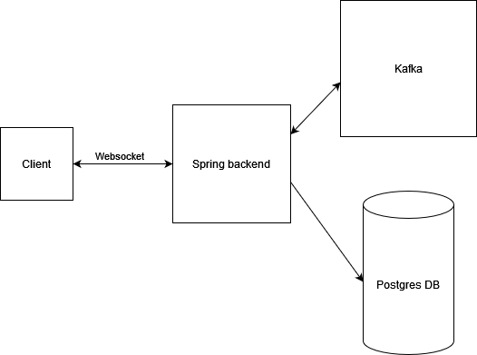

# Action Monitor
On http://localhost:8080 you can connect to a basic chat app where you can send and receive messages.
On http://localhost:8080/action-monitor you can watch the actions (now it's only insert) happening inside the application

## Usage
Use docker compose to run the application:
```bash
docker-compose up -d
```
It will start the backend with a postgres db and a kafka instance.

## Endpoints
**Chat url**: [http://localhost:8080]

**Actions**: [http://localhost:8080/action-monitor]

**Info**: [http://localhost:8080/actuator/info]

**Status**: [http://localhost:8080/actuator/healt]

## Architechture diagram



## Tests
I use only one integration test, where I tried to cover the whole flow of the application from sending a message, 
saving the message into the database and receiving on both message and actions topic.
I managed only to check the saved message in the database, but failed to parse messages with stomp-clients.

## Further improvements

- Testing
- Extend chat and actions with message update